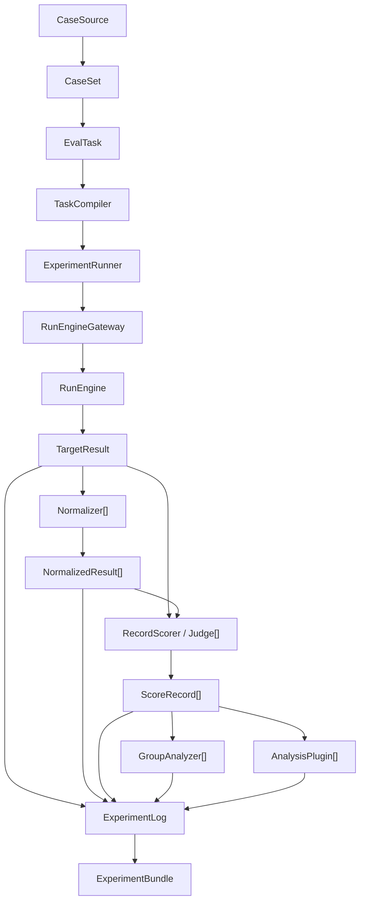

# WhitzardGen V2 Refactor Plan

## 1. Purpose

This document proposes a V2 architecture for WhitzardGen that preserves the current run engine as the strongest part of the system while making the benchmark and evaluation layer more coherent, extensible, and task-centric.

The central idea is:

- keep the run engine as the execution kernel
- introduce a first-class `EvalTask` abstraction above it
- stop flattening rich benchmark cases directly into prompt-only execution
- make evaluation, analysis, logging, and reporting operate on stable typed contracts

This is intentionally inspired by the design spirit of Inspect AI:

- task-first abstraction
- explicit data contracts
- reusable execution and scoring layers
- rich logging and reproducibility
- clear separation between task declaration and runtime execution

However, WhitzardGen V2 should not copy Inspect mechanically. It serves multimodal generation workloads and already has a valuable run engine with adapters, env handling, workers, recovery, and telemetry. V2 should wrap and elevate that engine, not replace it.

## 2. Core Positioning

WhitzardGen V2 should be defined as:

> A benchmark-centric multimodal evaluation framework built on top of a reusable run engine.

The run engine remains responsible for:

- model registry resolution
- env resolution
- adapter selection
- batching
- worker lifecycle
- recovery and retry
- runtime telemetry
- artifact production

The V2 evaluation framework becomes responsible for:

- declaring evaluation tasks
- freezing task configuration into a run plan
- compiling benchmark cases into execution requests
- executing targets through the run engine
- normalizing outputs
- scoring outputs
- aggregating group analyses
- logging all evaluation events
- writing experiment bundles and reports

## 3. Design Goals

### 3.1 Primary goals

- preserve the current run engine architecture and operational maturity
- introduce a stable top-level abstraction for evaluation workloads
- improve multimodal and structured-input support
- make benchmark/evaluator/plugin extension contracts clearer
- make experiment execution more inspectable and resumable
- reduce coupling between evaluation semantics and legacy annotation flows

### 3.2 Non-goals

- replacing the current adapter system
- rewriting the env manager
- building a distributed orchestration platform
- turning the framework into a notebook-style free-form analytics environment

## 4. Main V2 Thesis

The current V1 shape is mostly pipeline-first:

```text
benchmark build -> target execution -> normalization -> evaluation -> analysis -> report
```

V2 should become task-first:

```text
EvalTask -> compiled execution plan -> run engine -> typed evaluation outputs -> experiment bundle
```

This is a subtle but important shift.

In V1, users compose a workflow.
In V2, users declare a task, and the framework executes it.

That single change improves:

- reuse
- parameterization
- comparability
- discoverability
- long-term API stability

## 5. The Most Important Architectural Decision

`EvalTask` must be a declaration layer, not a new run engine.

That means:

- `EvalTask` describes what to evaluate
- `ExperimentRunner` decides how to execute it
- `RunEngineGateway` translates it into requests the run engine understands
- the run engine still performs the actual target execution

If `EvalTask` starts owning adapter details, env names, worker behavior, or batching internals, the design will regress.

The correct relationship is:

```text
EvalTask -> ExperimentRunner -> RunEngineGateway -> RunEngine
```

Not:

```text
EvalTask == RunEngine
```

## 6. V2 Core Abstractions

V2 should center around the following first-class abstractions.

### 6.1 CaseSource

Represents where cases come from.

Examples:

- static JSONL benchmark cases
- Python benchmark builders
- template packages
- synthetic scenario generators

Responsibilities:

- load or build canonical benchmark cases
- preserve provenance
- expose build metadata

### 6.2 CaseSet

A realized collection of canonical `BenchmarkCase` items plus metadata.

Responsibilities:

- hold the canonical case collection
- preserve benchmark provenance
- expose statistics
- support validation before execution

`CaseSet` is a better conceptual unit than "a folder containing JSONL files", even though it may still serialize to a bundle on disk.

### 6.3 BenchmarkCase

Still the atomic unit of target execution, but V2 should tighten its contract.

Required ideas:

- stable identity
- structured input contract
- benchmark lineage
- grouping metadata
- evaluation hints
- execution hints

V2 should stop assuming that a case is primarily a prompt string.

Instead, a case can describe:

- text input
- image-conditioned input
- video-conditioned input
- chat-style structured input
- tool- or schema-constrained response expectations
- benchmark-specific metadata and invariants

### 6.4 EvalTask

This is the central new abstraction.

An `EvalTask` declares:

- the case source or case set
- the target selection strategy
- the execution contract
- optional normalizers
- record scorers or judges
- group analyzers
- analysis plugins
- resume and failure policies
- output and logging policy

An `EvalTask` should be immutable once compiled for execution.

Important rule:

- `EvalTask` describes a task
- it does not execute target models directly

### 6.5 ExecutionRequest

This is the most important missing contract in V1.

Today, benchmark cases are effectively flattened into prompt records before execution. V2 should insert a typed `ExecutionRequest` layer between `BenchmarkCase` and the run engine.

`ExecutionRequest` should contain:

- case identity
- target model
- input modality
- structured input payload
- generation parameters
- expected output contract
- lineage metadata
- execution policy overrides

This allows the benchmark layer to preserve rich structure without forcing the run engine to understand every benchmark-specific concept.

The run engine only needs to consume a stable execution request shape.

### 6.6 TargetResult

The canonical output of target execution.

It should include:

- lineage back to the case and task
- target model identity
- runtime identity
- artifact references
- artifact metadata
- execution parameters
- execution status
- timing and telemetry summaries

V1 already has a good start here. V2 mainly needs to make the lineage and contract stricter.

### 6.7 NormalizedResult

A schema-light extraction layer between raw outputs and scoring.

Normalizers should remain optional and reusable.

They are especially useful for:

- extracting text decisions from free-form outputs
- detecting refusals
- extracting structured fields
- canonicalizing multimodal metadata

### 6.8 ScoreRecord

V2 should prefer the term `ScoreRecord` or `EvaluationRecord` over using only `EvaluatorResult`.

Why:

- it clarifies that the object is a scored judgment record
- it decouples the output from the implementation detail of which evaluator produced it
- it aligns better with cases where multiple scorers or judges contribute to one final record

Suggested contents:

- source case identity
- source target result identity
- scorer identity
- status
- labels
- numeric scores
- rationale
- raw judgment payload
- scorer metadata

### 6.9 GroupAnalysisRecord

Represents aggregated analysis over a slice of score records and optional normalized outputs.

Useful slices:

- family
- template
- perturbation group
- model
- benchmark split
- arbitrary user-defined group key

### 6.10 AnalysisPluginResult

Represents plugin-style post-processing outputs that may depend on:

- target results
- normalized results
- score records
- previous plugin outputs

V2 should keep this concept, but tighten its spec ownership and logging.

### 6.11 ExperimentLog

This is another major V2 addition.

V1 writes result artifacts well, but it does not yet have a strong append-only event model for experiment execution. V2 should introduce one.

`ExperimentLog` should record:

- task compilation
- resolved configs
- case counts
- execution start and end events
- per-target execution summaries
- normalization events
- scorer invocations
- analysis invocations
- failures
- retries
- resume decisions
- partial completion state

This log should be append-only and machine-readable.

### 6.12 ExperimentBundle

The final serialized result of an `EvalTask` run.

It should remain close to the existing experiment bundle concept, but become more strongly tied to:

- task definition
- compiled plan
- event log
- typed outputs

## 7. Proposed Core Architecture Diagram



## 8. Layer Responsibilities

### 8.1 Declaration layer

Contains:

- `CaseSource`
- `CaseSet`
- `EvalTask`

This layer should be stable and user-facing.

### 8.2 Planning layer

Contains:

- `TaskCompiler`
- compiled task plan
- target resolution
- evaluator resolution
- plugin dependency resolution
- policy freezing

This layer turns a declarative task into an executable plan.

### 8.3 Execution layer

Contains:

- `ExperimentRunner`
- `RunEngineGateway`
- current run engine

This layer performs work.

### 8.4 Evaluation layer

Contains:

- normalizers
- record scorers / judges
- group analyzers
- analysis plugins

This layer transforms execution outputs into evaluation outputs.

### 8.5 Artifact layer

Contains:

- event logs
- experiment bundles
- summaries
- reports

This layer makes work inspectable and reproducible.

## 9. How V2 Protects the Current Run Engine

The run engine is the strongest subsystem today. V2 should preserve it by enforcing the following rules.

### 9.1 The run engine remains the only execution kernel

There should still be exactly one place where model execution semantics live.

That place is the current run engine and its immediate runtime modules.

### 9.2 V2 introduces a gateway, not a replacement

`RunEngineGateway` should translate from:

- `ExecutionRequest`

to whatever the current engine needs:

- prompt files
- runtime manifests
- adapter-specific payloads
- future structured request formats

This lets the upper architecture evolve while keeping the engine stable.

### 9.3 The run engine should remain benchmark-agnostic

The run engine should not know about:

- ethics family IDs
- template perturbations
- benchmark plugins
- judge templates
- experiment summaries

It should know only execution requests, model configs, and artifact production.

### 9.4 V2 should gradually reduce prompt-only assumptions

In the short term, the gateway may still compile an `ExecutionRequest` down into the current `PromptRecord` path for compatibility.

That is acceptable as an intermediate step.

The key is to make the prompt-only conversion an implementation detail of the gateway, not the core benchmark abstraction.

## 10. Detailed V2 Contract Recommendations

## 10.1 BenchmarkCase contract

V2 should keep `BenchmarkCase`, but evolve it toward a clearer schema.

Suggested fields:

```python
class BenchmarkCase:
    benchmark_id: str
    case_id: str
    case_version: str | None
    input_modality: str
    input_payload: dict[str, Any]
    expected_output_contract: dict[str, Any] | None
    metadata: dict[str, Any]
    tags: list[str]
    split: str
    source_builder: str | None
    grouping: dict[str, str]
    execution_hints: dict[str, Any]
    evaluation_hints: dict[str, Any]
```

Notes:

- `prompt` can still exist as a convenience for text tasks
- but it should no longer be the primary conceptual field
- grouping metadata should become more explicit instead of living only in arbitrary metadata blobs

### 10.2 EvalTask contract

Suggested shape:

```python
class EvalTask:
    task_id: str
    task_version: str
    case_source: CaseSource | None
    case_set_path: str | None
    target_selector: TargetSelector
    execution_policy: ExecutionPolicy
    normalizers: list[NormalizerRef]
    scorers: list[ScorerRef]
    analyzers: list[AnalyzerRef]
    plugins: list[PluginRef]
    output_policy: OutputPolicy
    metadata: dict[str, Any]
```

Notes:

- tasks should be serializable
- tasks should be discoverable
- tasks should be usable from Python and CLI

### 10.3 ExecutionRequest contract

Suggested shape:

```python
class ExecutionRequest:
    task_id: str
    benchmark_id: str
    case_id: str
    target_model: str
    request_id: str
    input_modality: str
    input_payload: dict[str, Any]
    generation_params: dict[str, Any]
    expected_output_contract: dict[str, Any] | None
    metadata: dict[str, Any]
    runtime_hints: dict[str, Any]
```

This should be the object the gateway compiles into the current run engine inputs.

### 10.4 TargetResult contract

Suggested additions relative to V1:

- explicit `request_id`
- explicit `task_id`
- explicit execution status enum
- optional runtime summary
- optional timing metrics

### 10.5 ScoreRecord contract

Suggested shape:

```python
class ScoreRecord:
    task_id: str
    benchmark_id: str
    case_id: str
    target_model: str
    source_record_id: str
    scorer_id: str
    status: str
    labels: list[str]
    scores: dict[str, Any]
    rationale: str | None
    raw_judgment: Any
    scorer_metadata: dict[str, Any]
```

This can be backward-compatible with the current `EvaluatorResult`.

### 10.6 ExperimentLog event contract

Every event should include:

- `event_id`
- `timestamp`
- `experiment_id`
- `task_id`
- `stage`
- `entity_type`
- `entity_id`
- `status`
- `payload`

Example event types:

- `task_compiled`
- `target_execution_started`
- `target_execution_completed`
- `normalizer_completed`
- `scorer_completed`
- `analysis_plugin_completed`
- `resume_plan_applied`
- `failure_recorded`

## 11. Builder, Scorer, Analyzer, and Plugin Design

V2 should clean up extension ownership.

### 11.1 Builder

Builder responsibilities:

- produce valid benchmark cases
- attach provenance
- optionally emit build-time stats and manifests

Builder should not:

- execute models
- evaluate outputs
- perform analysis

### 11.2 Normalizer

Normalizer responsibilities:

- consume one target result
- optionally use task/case context
- emit schema-light normalized fields

Normalizer should not:

- own final scoring semantics
- write reports

### 11.3 Scorer

V2 should shift terminology from "evaluator" toward "scorer" at the record level, even if legacy compatibility retains `evaluator` in file names and CLI temporarily.

A scorer can be:

- rule-based
- judge-model-based
- vision-language-judge-based
- deterministic extractor + score function

Important design change:

scorers should operate on a single typed unit:

- `BenchmarkCase`
- `TargetResult`
- optional `NormalizedResult`

They should not fundamentally depend on rerunning an entire source run bundle unless that is just an implementation backend.

### 11.4 GroupAnalyzer

Should aggregate across a defined slice:

- family
- group key
- template
- split
- model

Group analyzers should have explicit slice definitions rather than relying only on ad hoc metadata conventions.

### 11.5 AnalysisPlugin

Plugins are still valuable, but they should be framed as post-score transformations or analyses rather than a catch-all extension point.

Good uses:

- sensitivity analyses
- robustness summaries
- contradiction mining
- cross-target comparisons

Bad uses:

- doing the job of record scorers
- replacing missing case modeling
- compensating for weak core grouping contracts

## 12. Naming Recommendations

V2 will be easier to understand if some names become clearer.

Recommended naming evolution:

- keep `benchmark` for the case collection concept
- keep `run engine` for the execution kernel
- prefer `EvalTask` for top-level declarative workloads
- prefer `scorer` for record-level judgment
- keep `analyzer` for group aggregation
- keep `plugin` for optional post-processing

Practical compatibility approach:

- internal new types may use `Scorer`
- public CLI can still expose `evaluate` and `evaluator` until migration is complete

## 13. CLI Design for V2

V2 CLI should become more task-oriented.

### 13.1 Proposed CLI direction

Short-term:

- keep existing commands
- add task-oriented commands alongside them

Medium-term:

- make task-oriented commands the primary path

Suggested commands:

```bash
aigc tasks list
aigc tasks inspect <task_id>
aigc tasks run <task_id>
aigc tasks compile <task_id>
```

Supporting commands:

```bash
aigc benchmark build ...
aigc evaluate run ...
```

can remain as lower-level or compatibility flows.

### 13.2 Why this helps

It lets users think in terms of:

- "run this evaluation task"

instead of:

- "manually compose benchmark + targets + evaluators + plugins each time"

## 14. Logging and Reproducibility

This is one of the most important V2 improvements.

### 14.1 What should be frozen in the experiment bundle

- compiled task spec
- resolved target list
- resolved normalizer/scorer/analyzer/plugin specs
- benchmark manifest
- execution policy
- launch plan
- environment snapshot where feasible
- artifact paths

### 14.2 What should be logged incrementally

- per-stage events
- per-target events
- per-scorer events
- all failures
- resume/retry actions
- partial completion markers

### 14.3 Why this matters

It enables:

- post-hoc analysis without re-running
- partial replay
- future re-scoring
- UI drill-down
- comparison across experiments

## 15. Migration Strategy

V2 should be introduced in phases, not as a big bang rewrite.

### Phase 0: Preserve current behavior

Do not break:

- `run`
- `annotate`
- existing benchmark bundles
- existing experiment bundles
- current tests

### Phase 1: Introduce new contracts without changing behavior

Implement:

- `EvalTask` models
- `ExecutionRequest` models
- `ScoreRecord` alias or wrapper
- `ExperimentLog`

At this stage:

- existing code paths still run
- the new models are mostly introduced as structure and compatibility wrappers

### Phase 2: Add a RunEngineGateway

Implement a gateway that compiles `ExecutionRequest` to the current prompt/run path.

At this stage:

- benchmark execution still uses the current engine
- the upper layer now targets `ExecutionRequest`

### Phase 3: Refactor benchmark orchestration into ExperimentRunner

Break the current benchmarking service monolith into:

- task compilation
- target execution orchestration
- normalization orchestration
- scoring orchestration
- aggregation orchestration
- bundle writing

### Phase 4: Decouple record scoring from `annotate_run`

Keep `annotate_run` as a reusable backend, but define scorers as a separate first-class API.

This is a crucial architectural cleanup step.

### Phase 5: Introduce task-oriented CLI

Add:

- `tasks list`
- `tasks inspect`
- `tasks compile`
- `tasks run`

without removing the current CLI yet.

### Phase 6: Tighten schemas and deprecate prompt-only assumptions

Once the gateway path is stable:

- migrate richer case input contracts
- support structured and multimodal execution requests more directly

## 16. Compatibility Plan

V2 should preserve existing users through compatibility layers.

### 16.1 Bundle compatibility

Existing benchmark bundles and experiment bundles should still load.

If necessary:

- add manifest versioning
- add upgrade readers
- allow V1 fields to map into V2 objects

### 16.2 CLI compatibility

Existing commands should continue to work during the migration window.

### 16.3 Data model compatibility

`EvaluatorResult` can remain temporarily, but V2 should internally treat it as either:

- an alias of `ScoreRecord`
- or a legacy-compatible serialization form of `ScoreRecord`

## 17. Suggested Module Layout

One possible V2 package structure:

```text
src/aigc/tasks/
  models.py
  compiler.py
  registry.py
  service.py

src/aigc/contracts/
  cases.py
  execution.py
  results.py
  logs.py

src/aigc/experiments/
  runner.py
  bundle.py
  reporting.py
  logging.py

src/aigc/scoring/
  interfaces.py
  service.py
  config.py

src/aigc/runtime_gateway/
  service.py
  prompt_bridge.py
```

This does not require moving everything immediately, but it shows the direction:

- contracts separate from services
- tasks separate from experiments
- scoring separate from legacy annotation naming
- gateway explicit instead of hidden inside benchmarking service

## 18. Suggested Implementation Backlog

The following order is recommended for Codex implementation.

### Step 1

Introduce new models:

- `EvalTask`
- `ExecutionRequest`
- `ScoreRecord`
- `ExperimentEvent`

### Step 2

Add serialization support and tests for those models.

### Step 3

Implement `RunEngineGateway` that emits the current prompt/run path.

### Step 4

Refactor the current benchmark evaluation path to:

- compile cases into execution requests
- execute them through the gateway

without changing final outputs yet.

### Step 5

Introduce `ExperimentLog` writing during benchmark runs.

### Step 6

Refactor evaluator service into scorer service with adapter compatibility.

### Step 7

Add task-oriented CLI and example task definitions.

## 19. Specific V1 Problems V2 Should Solve

### 19.1 Pipeline orchestration is too centralized

The current benchmark evaluation flow owns too many responsibilities in one service entrypoint.

V2 should split:

- compilation
- execution
- scoring
- analysis
- bundling

### 19.2 Rich cases are flattened too early

The system currently preserves rich case metadata but effectively executes via prompt-only conversion.

V2 should preserve structure until the runtime gateway boundary.

### 19.3 Scoring is too coupled to annotation bundles

Record scoring should be a primary evaluation abstraction, not an adaptation of legacy annotate workflows.

### 19.4 Extension ownership is fragmented

Specs and discovery logic should be unified so builders, normalizers, scorers, and plugins feel like one coherent extension system.

### 19.5 Logging is result-heavy but event-light

V2 should add append-only execution logs and richer frozen manifests.

## 20. Acceptance Criteria for V2

V2 is successful if the following are true.

### 20.1 Architectural criteria

- the run engine remains intact and benchmark-agnostic
- `EvalTask` is a first-class concept
- `ExecutionRequest` exists and is used as the boundary to the run engine
- scoring no longer fundamentally depends on whole-run annotation semantics

### 20.2 Product criteria

- users can run a task with a single stable abstraction
- experiment bundles preserve richer lineage and logs
- multimodal and structured-input cases are better supported
- extensions are easier to add and understand

### 20.3 Migration criteria

- existing benchmark/evaluate commands still work
- current tests still pass or are replaced with stronger equivalents
- old bundle formats remain readable

## 21. Risks and Mitigations

### Risk 1: `EvalTask` becomes a god object

Mitigation:

- keep it declarative
- forbid runtime/adapter/env internals inside task models

### Risk 2: migration churn without practical gain

Mitigation:

- add the gateway first
- preserve current engine behavior
- migrate incrementally with compatibility tests

### Risk 3: naming churn confuses users

Mitigation:

- preserve CLI compatibility
- introduce new names gradually
- document terminology mapping clearly

### Risk 4: event logging becomes noisy or expensive

Mitigation:

- define a minimal required event schema
- separate summary-level and detailed-level logs
- keep large artifacts referenced by path instead of duplicated inline

## 22. Final Recommendation

WhitzardGen V2 should not be a rewrite of the run engine.

It should be a refactor that does three things well:

1. introduce `EvalTask` as the stable top-level abstraction
2. introduce `ExecutionRequest` as the boundary between benchmark semantics and runtime execution
3. introduce `ExperimentLog` as the missing event and reproducibility layer

If those three are done well, the rest of the system can evolve cleanly around them while preserving the best part of the project today: the run engine.

## 23. Suggested Immediate Next Actions

The next implementation steps for Codex should be:

1. add V2 model classes and serialization tests
2. implement a gateway from `ExecutionRequest` to the current prompt/run engine path
3. refactor benchmark evaluation to route through the gateway
4. add append-only experiment event logging
5. split record scoring from the legacy annotation-centric path

That sequence preserves working behavior while steadily moving the architecture toward V2.
